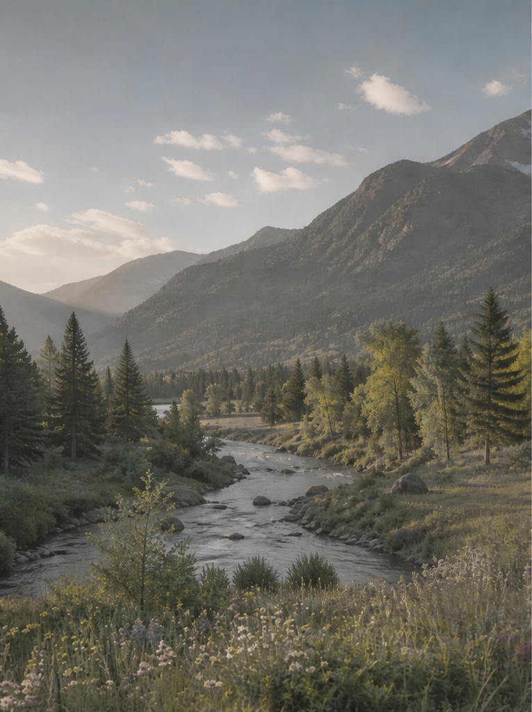

# Genlock and HDR Video Pipeline System Example Designs for Agilex™ Devices

## Overview

This repository contains projects demonstrating how to create and build 
Video Pipeline System Example Designs, using Altera®'s off the shelf [Video and Vision Processing (VVP) IP cores](https://www.altera.com/products/ip/po-3150/video-and-vision-processing-suite),
targeting [Altera® Agilex™ devices](https://www.altera.com/fpga).

The projects are stored in individual folders, classified by device families and target devkits.

---

## 4Kp60 SDI-based Genlock HDR Video Pipeline for Agilex™ 5 Devices

| | |
|---|---|
| **Target device family** | [Agilex™ 5E](https://www.altera.com/products/fpga/agilex/5/e-series) |
| **Development kit** | [Agilex™ 5 FPGA and SoC E-Series 065B Modular Development Kit](https://www.altera.com/products/devkit/po-3274/agilex-5-fpga-and-soc-e-series-065b-modular-development-kit) |
| **Control plane** | [Nios® V Processor](https://www.altera.com/products/ip/po-3098/nios-v-processors) with a bare-metal software application |
| **Precompiled SOF** | [Version_26.1.1](https://github.com/altera-fpga/agilex5-ed-genlock-hdr-video/releases/download/rel-26.1.1/golden_4k_sdi_genlock_hdr_ed.sof) |
| **Quartus Project** | [Version_26.1.1](https://github.com/altera-fpga/agilex5-ed-genlock-hdr-video/releases/download/rel-26.1.1/agilex5e_mdk_4k_sdi_genlock_hdr_ed.zip) |
| **Source Code** | [Version_26.1.1](https://github.com/altera-fpga/agilex5-ed-genlock-hdr-video/tree/rel/26.1.1/agilex5e-ed/a5e065b-mod-devkit) |
| **User Guide** | [Version_26.1.1](https://github.com/altera-fpga/agilex5-ed-genlock-hdr-video/blob/rel/26.1.1/agilex5e-ed/a5e065b-mod-devkit/docs/doc-genlock-hdr.md) |

 

|
SDI Input Image 
|
SDI Output Image
|
| --- | --- |
|  |   |

---

