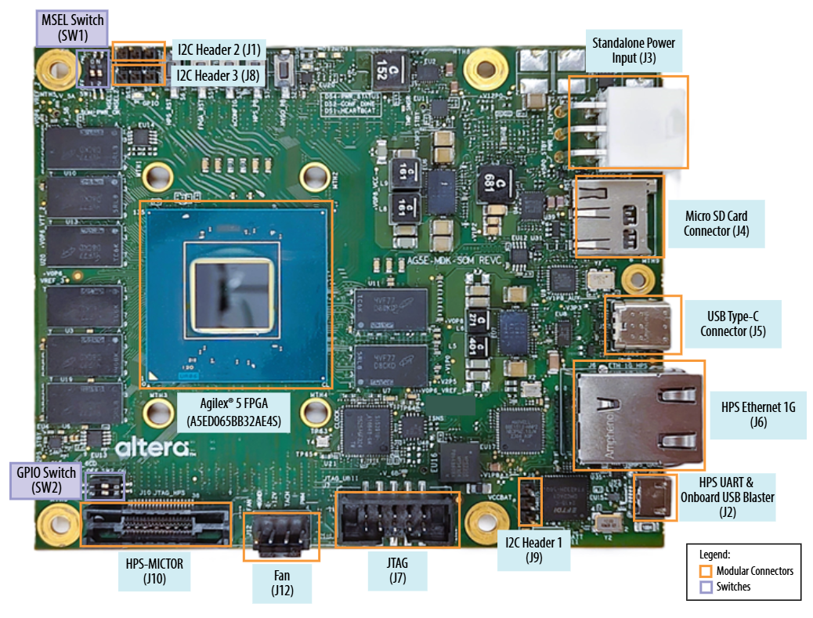
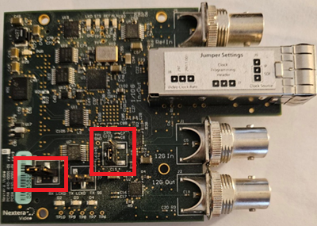
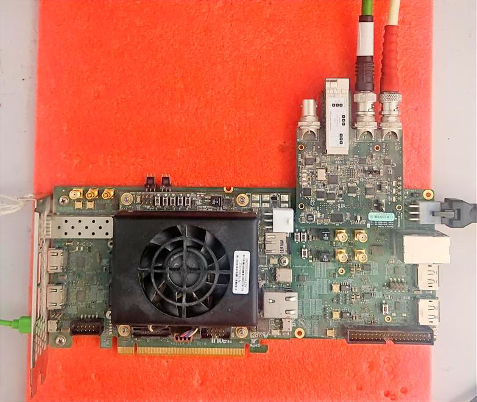
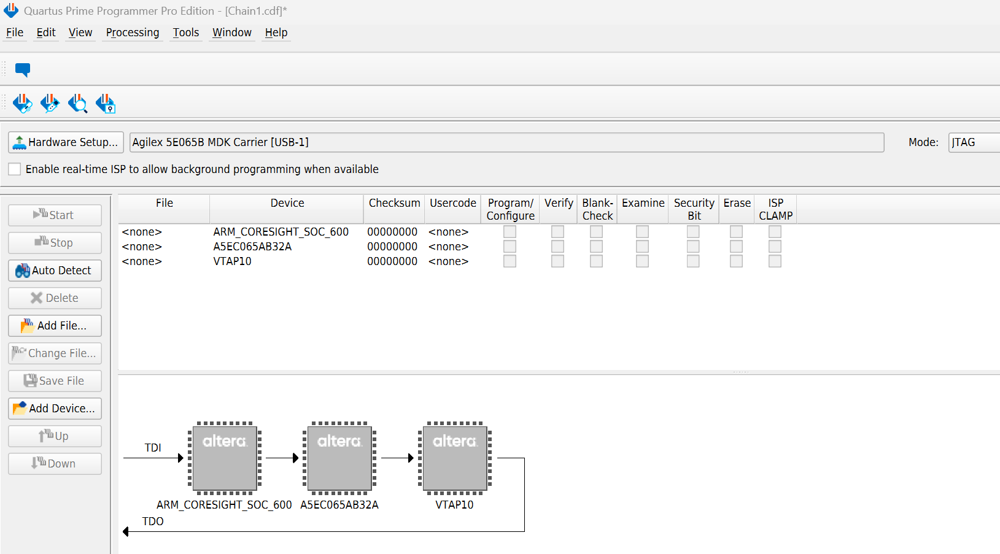
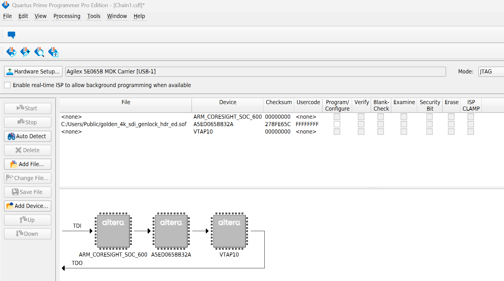
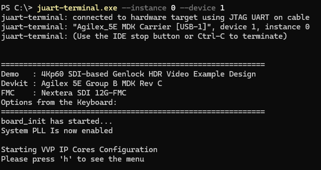
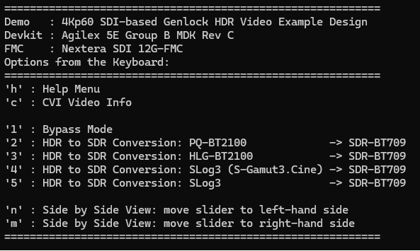
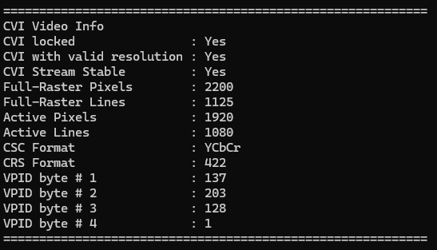

# 4Kp60 SDI-based Genlock HDR Video Pipeline System Example Design for Agilex™ 5 Devices

This design is compatible with
[Altera® Quartus® Prime Pro Edition software version 26.1.1](https://www.altera.com/downloads/fpga-development-tools/quartus-prime-pro-edition-design-software-version-26-1-1-linux).

> **Important:** This document contains hyperlinks to related documentation. Figures and screenshots are examples. The hardware and software that you observe may differ slightly from the figures in this document.

---

## Contents

* [Overview](#overview)
* [Features and Specifications](#features-and-specifications)
* [Prerequisites](#prerequisites)
* [Getting Started](#getting-started)
* [Testing the Example Design on the Development Kit](#testing-the-example-design-on-the-development-kit)
* [Compiling the Example Design from Scratch](#compiling-the-example-design-from-scratch)
* [Functional Description](#functional-description)
* [Additional Information](#additional-information)
* [Related Documents](#related-documents)

---

## Overview

The 4Kp60 SDI-based Genlock HDR Video Pipeline System Example Design for Agilex™ 5 Devices demonstrates three-dimensional lookup table (3D LUT)-based conversion between high dynamic range (HDR) and standard dynamic range (SDR) video. HDR-to-SDR conversion is required for interoperability between legacy and emerging formats in broadcast workflows.

The following figure shows example SDI input and output images, after applying a 3D LUT on the input image.

|<center markdown="1">SDI Input Image</center>|<center markdown="1">SDI Output Image</center>|
| --- | --- |
|  |  |

The design receives video through an industry-standard serial digital interface (SDI) on an FPGA mezzanine card (FMC) daughter card. The SDI interface supports video standards up to 12G-SDI and can deliver video resolutions up to 4Kp60 to the FPGA fabric. The SDI IP converts pixel data to AXI4-Stream, which provides connectivity to other IP cores in the [Altera Video and Vision Processing (VVP) Suite](https://www.altera.com/products/ip/po-3150/video-and-vision-processing-suite).

The design comprises hardware and software components:

* The software is a bare-metal application that runs on a Nios® V soft processor. The application provides runtime control and debug menus through a JTAG UART interface.

  The following figure shows the interaction between the Nios® V software and the hardware in the FPGA fabric.

<p align="center">
  
  <br><em>Figure. SDI-based Genlock HDR Video Pipeline Example Design—Top-Level System Block Diagram</em>
</p>

* The hardware includes one bypass path and two HDR datapaths. Each path is fully genlocked and does not use a frame buffer. The hardware also includes VVP Suite IP cores and an embedded processor subsystem. Each HDR datapath contains a 3D LUT IP core that is initialized with 3D cube files that implement a specific HDR-to-SDR conversion.

  A Mixer IP at the output of the pipeline combines the HDR and bypass streams with a background layer from the Test Pattern Generator (TPG) IP into a single video frame. The software can configure the Mixer IP for side-by-side display of the input video and the 3D LUT result. Processed video leaves the design through the SDI transmit interface.

  The following figure shows the main hardware components and subsystems.

<p align="center">
  
  <br><em>Figure. SDI-based Genlock HDR Video Pipeline Example Design—Top-Level Hardware Block Diagram</em>
</p>

---

## Features and Specifications

The example design provides the following features:

* **Video interface (input and output)**
  * Serial digital interface (SDI)

* **Progressive resolutions (input and output)**
  * 720p at 60 Hz
  * 1080p at 30 Hz and 60 Hz
  * 2K (2048×1080) at 30 Hz and 60 Hz
  * 2160p at 30 Hz and 60 Hz
  * 4K (4096×2160) at 30 Hz and 60 Hz

* **Color formats (input and output)**
  * RGB
  * YCbCr 4:4:4 and 4:2:2

* **Bit depth (input and output)**
  * 10 bits per color channel

* **Multi-channel video processing subsystem**
  * 10-bit RGB processing at 2 pixels in parallel
  * 300 MHz processing clock
  * VVP IP cores:
    * [Video Streaming FIFO](https://docs.altera.com/r/docs/683329/25.1/video-and-vision-processing-suite-ip-user-guide/video-streaming-fifo-ip)
    * [Chroma Resampler](https://docs.altera.com/r/docs/683329/25.1/video-and-vision-processing-suite-ip-user-guide/chroma-resampler-ip)
    * [Color Space Converter](https://docs.altera.com/r/docs/683329/25.1/video-and-vision-processing-suite-ip-user-guide/color-space-converter-ip)
    * [Protocol Converter](https://docs.altera.com/r/docs/683329/25.1/video-and-vision-processing-suite-ip-user-guide/protocol-converter-ip)
    * [AXI-Stream Broadcaster](https://docs.altera.com/r/docs/683329/25.1/video-and-vision-processing-suite-ip-user-guide/axi-stream-broadcaster-ip)
    * [Clipper](https://docs.altera.com/r/docs/683329/25.1/video-and-vision-processing-suite-ip-user-guide/clipper-ip)
    * [Test Pattern Generator](https://docs.altera.com/r/docs/683329/25.1/video-and-vision-processing-suite-ip-user-guide/test-pattern-generator-ip)
    * [Mixer](https://docs.altera.com/r/docs/683329/25.1/video-and-vision-processing-suite-ip-user-guide/mixer-ip)
    * [3D LUT](https://docs.altera.com/r/docs/683329/25.1/video-and-vision-processing-suite-ip-user-guide/about-the-3d-lut-ip)

* **Input video broadcaster**
  * One input and three outputs
  * Input from the SDI receive (RX) video datapath
  * Broadcast to one bypass path and two HDR processing paths

* **Output video mixer**
  * Overlay of the processed and bypass video streams
  * Background layer from the TPG IP
  * Optional side-by-side mode

* **HDR-to-SDR conversions using 3D LUTs**
  * [HLG](https://www.itu.int/dms_pubrec/itu-r/rec/bt/R-REC-BT.2100-3-202502-I!!PDF-E.pdf) to [BT.1886/BT.709](https://www.itu.int/dms_pubrec/itu-r/rec/bt/r-rec-bt.1886-0-201103-i!!pdf-e.pdf)
  * [PQ](https://www.itu.int/dms_pubrec/itu-r/rec/bt/R-REC-BT.2100-3-202502-I!!PDF-E.pdf) to [BT.1886/BT.709](https://www.itu.int/dms_pubrec/itu-r/rec/bt/r-rec-bt.1886-0-201103-i!!pdf-e.pdf)
  * [S-Log3](https://pro.sony/en_GB/technology/s-log) to [BT.1886/BT.709](https://www.itu.int/dms_pubrec/itu-r/rec/bt/r-rec-bt.1886-0-201103-i!!pdf-e.pdf)

---

## Prerequisites

### Hardware Requirements

The following hardware components are required:

* [Agilex™ 5 FPGA and SoC E-Series 065B Modular Development Kit](https://www.altera.com/products/devkit/po-3274/agilex-5-fpga-and-soc-e-series-065b-modular-development-kit)
* [Nextera 12G-SDI FMC Daughter Card](https://www.nexteravideo.com/12g-sdi-fmc/)
* Power supply
* USB cable (USB-A to Micro-USB) for JTAG and serial console
* 12G-SDI certified cables
* 12G-SDI generator with HDR video capabilities
* 12G-SDI analyzer with HDR video capabilities

The following figure shows the Agilex™ 5 FPGA and SoC E-Series 065B Modular Development Kit.

<p align="center">
  
  <br><em>Figure. Agilex™ 5 FPGA and SoC E-Series 065B Modular Development Kit</em>
</p>

### Software Requirements

The following software tools are required:

* [Altera® Quartus® Prime Pro Edition software version 26.1.1](https://www.altera.com/downloads/fpga-development-tools/quartus-prime-pro-edition-design-software-version-26-1-1-linux)
* Agilex™ 5 device support
* [Visual Designer Studio](https://www.altera.com/products/development-tools/visual-designer-studio)
* [FPGA Nios® V Open-Source Tools version 26.1.1](https://www.altera.com/design/guidance/nios-v-developer)

### Repository and Release Tag

The following table lists the source files and release tag for Quartus® Prime Pro Edition software version 26.1.1.

> **Note:** This system example design is provided for demonstration only. The design is not suitable for production or final deployment.

| Component | Location | Branch / Tag |
|-----------|----------|--------------|
| Assets release tag | [rel-26.1.1](https://github.com/altera-fpga/agilex5-ed-genlock-hdr-video/releases/tag/rel-26.1.1) | `rel-26.1.1` |
| Precompiled SOF | [golden_4k_sdi_genlock_hdr_ed.sof](https://github.com/altera-fpga/agilex5-ed-genlock-hdr-video/releases/download/rel-26.1.1/golden_4k_sdi_genlock_hdr_ed.sof) | `rel-26.1.1` |
| Quartus Project | [agilex5e_mdk_4k_sdi_genlock_hdr_ed.zip](https://github.com/altera-fpga/agilex5-ed-genlock-hdr-video/releases/download/rel-26.1.1/agilex5e_mdk_4k_sdi_genlock_hdr_ed.zip) | `rel-26.1.1` |
| Source code | [agilex5e-ed/a5e065b-mod-devkit](https://github.com/altera-fpga/agilex5-ed-genlock-hdr-video/tree/rel/26.1.1/agilex5e-ed/a5e065b-mod-devkit) | `rel-26.1.1` |
| Public repository | [https://github.com/altera-fpga/agilex5-ed-genlock-hdr-video/tree/rel/26.1.1) | `rel-26.1.1` |

---

## Getting Started

This section describes how to download a precompiled SRAM Object File (.sof) and run the example design on the Agilex™ 5 FPGA and SoC E-Series 065B Modular Development Kit.

### Downloading the Precompiled FPGA SOF

The following table lists the precompiled programming file.

| Source | Link | Description | Device Part Number |
|--------|------|-------------|--------------------|
| Precompiled SOF | [golden_4k_sdi_genlock_hdr_ed.sof](https://github.com/altera-fpga/agilex5-ed-genlock-hdr-video/releases/download/rel-26.1.1/golden_4k_sdi_genlock_hdr_ed.sof) | SOF for the [Agilex™ 5 FPGA and SoC E-Series 065B Modular Development Kit](https://www.altera.com/products/devkit/po-3274/agilex-5-fpga-and-soc-e-series-065b-modular-development-kit) | A5ED065BB32AE4S |

### Setting Up the Development Kit

> **Warning:** Handle electrostatic discharge (ESD)-sensitive equipment only when you are properly grounded and working at an ESD-safe workstation.

To set up the development kit, follow these steps:

1. Ensure that the development kit is switched off.

2. Configure the Agilex™ 5 FPGA E-Series 065B Modular Development Kit switches to the factory default positions. For switch settings, refer to the [Agilex 5 FPGA E-Series 065B Modular Development Kit User Guide](https://docs.altera.com/r/docs/820977/current/agilex-5-fpga-e-series-065b-modular-development-kit-user-guide/default-settings).

   The following figures show the switch locations on the system-on-module (SOM) and the carrier board.

<p align="center">
  
  <br><em>Figure. Modular Development Kit—System-on-Module (SOM) Switch Locations</em>
</p>

<p align="center">
  
  <br><em>Figure. Modular Development Kit—Carrier Topside Switch Locations</em>
</p>

3. Connect a USB-JTAG cable between the host computer and USB connector J35 on the development kit.

4. Configure the Nextera card for **297 MHz** and **SDI mode**, as shown in the following figure.

<p align="center">
  
  <br><em>Figure. Nextera 12G-SDI FMC Daughter Card</em>
</p>

5. Connect the Nextera 12G-SDI FMC daughter card on FMC port J7.

6. Connect an SDI cable between the BNC RX connector on the FMC card (J1 / 12G In) and an external SDI video source.

7. Connect an SDI cable between the BNC TX connector on the FMC card (J2 / 12G Out) and an SDI video monitor.

8. Connect the power supply to connector J14 on the development kit.

The hardware setup should match the following figure.

<p align="center">
  
  <br><em>Figure. Complete Hardware Setup</em>
</p>

---

## Testing the Example Design on the Development Kit

This section describes how to program the FPGA and run the demonstration software.

### Programming the Development Kit

To program the development kit, follow these steps:

1. Complete the hardware setup described in [Getting Started](#getting-started).

2. Power up the board.

3. Launch the Quartus® Programmer and configure **Hardware Setup** as shown in the following figure.

<p align="center">
  
  <br><em>Figure. Programmer GUI—Hardware Settings</em>
</p>

4. Click **Auto Detect**, select device `A5ED065BB32AE`, and then click **Change File**.

<p align="center">
  
  <br><em>Figure. Programmer After Auto Detect</em>
</p>

5. Select the SRAM Object File (for example, `golden_4k_sdi_genlock_hdr_ed.sof`).

6. Turn on the **Program/Configure** option, and then click **Start**.

7. Wait until programming completes.

<p align="center">
  
  <br><em>Figure. Programming the FPGA with an SRAM Object File</em>
</p>

### Running the Demonstrations

After programming completes, open a JTAG UART terminal.

On Linux, type the following command:

```bash
juart-terminal --instance 0 --device 1
```

On Windows, type the following command:

```bash
juart-terminal.exe --instance 0 --device 1
```

When the connection is successful, the terminal displays the demonstration banner.

<p align="center">
  
  <br><em>Figure. Demonstration Banner</em>
</p>

Press **h** to display the demonstration menu.

<p align="center">
  
  <br><em>Figure. Demonstration Menu</em>
</p>

Each menu option is mapped to a keyboard character. The following table lists the demonstration menu commands.

| Key | Action |
|:---:|--------|
| `h` | Display the help menu |
| `c` | Display debug information for the incoming video frame |
| `1` | Enable bypass mode |
| `2` | Enable HDR-to-SDR conversion: PQ (BT.2100) to BT.709 |
| `3` | Enable HDR-to-SDR conversion: HLG (BT.2100) to BT.709 |
| `4` | Enable HDR-to-SDR conversion: S-Log3 (S-Gamut3.Cine) to BT.709 |
| `5` | Enable HDR-to-SDR conversion: S-Log3 to BT.709 |
| `n` | Side-by-side view: move the current image to the left and display the bypass image on the right |
| `m` | Side-by-side view: move the current image to the right and display the processed image on the left |

Press **c** to display incoming frame status, as shown in the following figure.

<p align="center">
  
  <br><em>Figure. Incoming Frame Status</em>
</p>

The **m** and **n** keys adjust the side-by-side split, in steps of 8 pixels.

---

## Compiling the Example Design from Scratch

This section describes how to compile the example design in the Quartus® Prime Pro Edition software and generate an SRAM Object File (.sof).

To compile the example design, follow these steps:

1. Download the example design from the repository listed in the following table.

| Component | Location | Branch / Tag |
|-----------|----------|--------------|
| Assets release tag | [rel-26.1.1](https://github.com/altera-fpga/agilex5-ed-genlock-hdr-video/releases/tag/rel-26.1.1) | `rel-26.1.1` |

2. Extract the package.

3. Confirm that the FPGA design files are in `src/vds/`, `src/rtl/` and `src/ip/`.

4. Confirm that the software files are in `src/sw/`.

   The example design directory structure is as follows:

```text
<Example Design>/
├── sdi_genlock_hdr_ed.qpf   # Quartus project file
├── sdi_genlock_hdr_ed.qsf   # Quartus settings file
├── da_drc.dawf              # Design Assistant waiver file
├── README.md                # Repository readme
├── docs/                    # User guide for this example design
├── output_files/            # Precompiled SOF
├── script/                  # Scripts used to generate the example design
└── src/
    ├── ip/                  # .ip files
    ├── rtl/                 # RTL and SDC files
    ├── sw/                  # Bare-metal software application
    └── vds/                 # Tcl to generate the Visual Designer Studio (VDS) project
        └── test_luts/       # A collection of 3D cube files to preconfigure the 3D LUT IP
```

5. Launch the Quartus® Prime Pro Edition software.

6. Open `<Example Design>/sdi_genlock_hdr_ed.qpf`.

7. On the **Processing** menu, click **Start Compilation**.

8. Wait until compilation completes.

After a successful compilation, the Quartus® Prime software generates the programming file in the `<Example Design>/output_files/` directory:

* `sdi_genlock_hdr_ed.sof`

### Recompiling the Nios® V Software Application

To rebuild the Nios® V software application and merge it into the .sof, type the following commands:

```bash
cd <Example Design>/script/
quartus_sh -t post_swapp_sdi_gen.tcl
```

The script compiles the Nios® V application, merges the generated hexadecimal (HEX) ROM into the project, and generates an updated `sdi_genlock_hdr_ed.sof` that contains the latest software.

---

## Functional Description

For a description of the video pipeline, IP cores, genlock architecture, and 3D LUT conversion, refer to [Functional Description](./genlock-hdr-funct-descr.md).

---

## Additional Information

* [Design Security Considerations](./design-security-considerations.md)
* [Acronyms and Terminology](./glossary.md)

---

## Related Documents

* [Agilex™ 5 FPGA and SoC E-Series 065B Modular Development Kit](https://www.altera.com/products/devkit/po-3274/agilex-5-fpga-and-soc-e-series-065b-modular-development-kit)
* [Nextera 12G-SDI FMC Daughter Card](https://www.nexteravideo.com/12g-sdi-fmc/)
* [Phabrix QxL SDI Generator and Analyzer](https://leaderphabrix.com/products/qxl/)
* [Video and Vision Processing Suite Altera® FPGA IP User Guide](https://www.altera.com/products/ip/po-3150/video-and-vision-processing-suite)
* [Altera® FPGA Streaming Video Protocol Specification](https://docs.altera.com/r/docs/683397/current/altera-streaming-video-protocol-specification/about-the-altera-streaming-video-protocol)
* [AMBA 4 AXI4-Stream Protocol Specification](https://developer.arm.com/documentation/ihi0051/a/)
* [GTS SDI II IP User Guide](https://docs.altera.com/r/docs/823539/25.3/gts-sdi-ii-ip-user-guide/gts-sdi-ii-ip-quick-reference)
* [Visual Designer Studio](https://www.altera.com/products/development-tools/visual-designer-studio)
* [Nios® V Processor](https://www.altera.com/products/ip/po-3098/nios-v-processors)

---

## Notices & Disclaimers

Altera<sup>&reg;</sup> Corporation technologies may require enabled hardware, software or service activation.
No product or component can be absolutely secure.
Performance varies by use, configuration and other factors.
Your costs and results may vary.
You may not use or facilitate the use of this document in connection with any infringement or other legal analysis concerning Altera or Intel products described herein. You agree to grant Altera Corporation a non-exclusive, royalty-free license to any patent claim thereafter drafted which includes subject matter disclosed herein.
No license (express or implied, by estoppel or otherwise) to any intellectual property rights is granted by this document, with the sole exception that you may publish an unmodified copy. You may create software implementations based on this document and in compliance with the foregoing that are intended to execute on the Altera or Intel product(s) referenced in this document. No rights are granted to create modifications or derivatives of this document.
The products described may contain design defects or errors known as errata which may cause the product to deviate from published specifications. Current characterized errata are available on request.
Altera disclaims all express and implied warranties, including without limitation, the implied warranties of merchantability, fitness for a particular purpose, and non-infringement, as well as any warranty arising from course of performance, course of dealing, or usage in trade.
You are responsible for safety of the overall system, including compliance with applicable safety-related requirements or standards.
<sup>&copy;</sup> Altera Corporation. Altera, the Altera logo, and other Altera marks are trademarks of Altera Corporation. Other names and brands may be claimed as the property of others.

OpenCL* and the OpenCL* logo are trademarks of Apple Inc. used by permission of the Khronos Group™.


