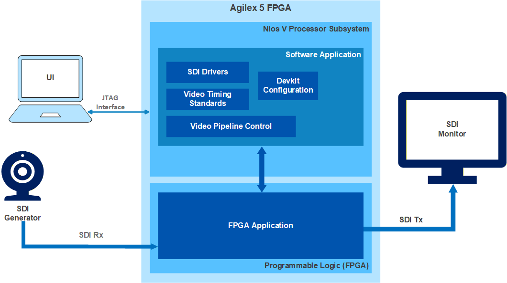
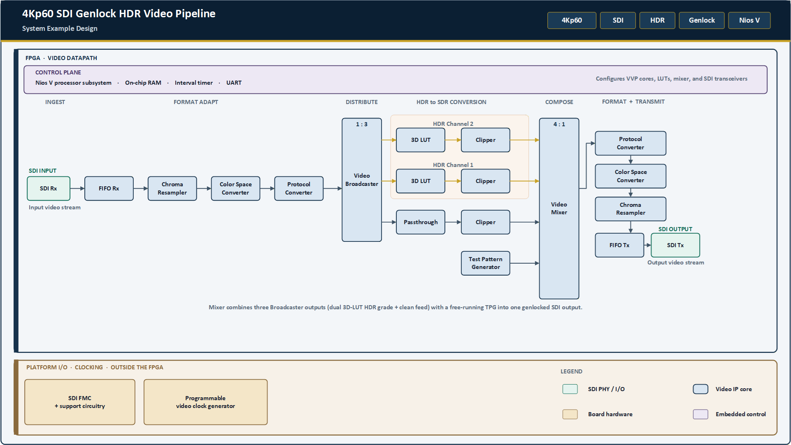
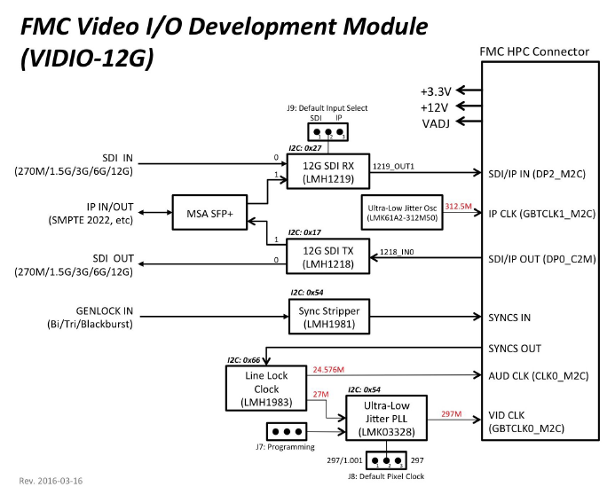
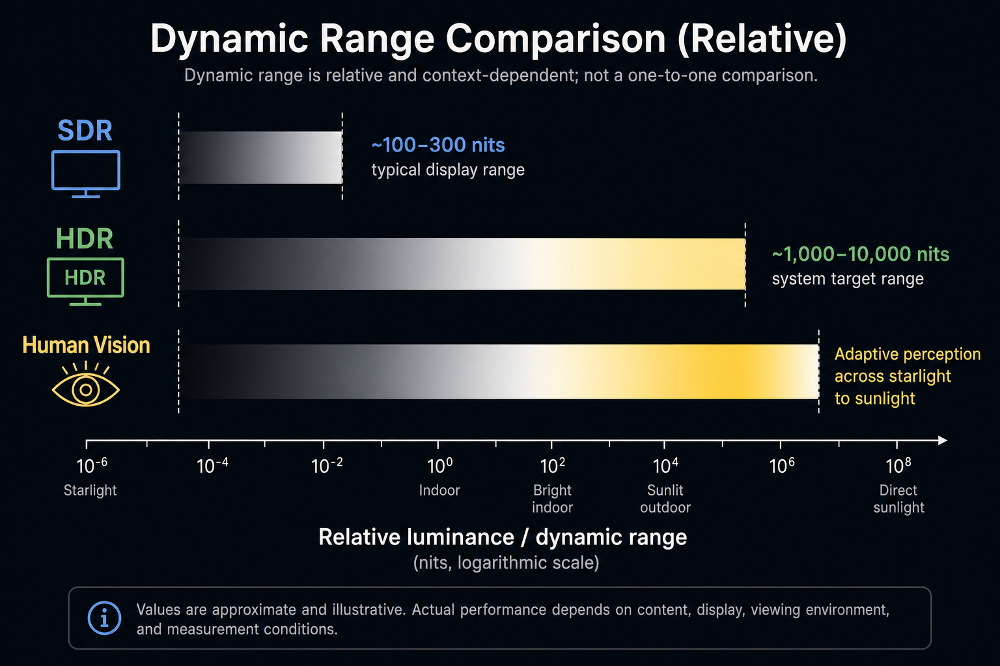
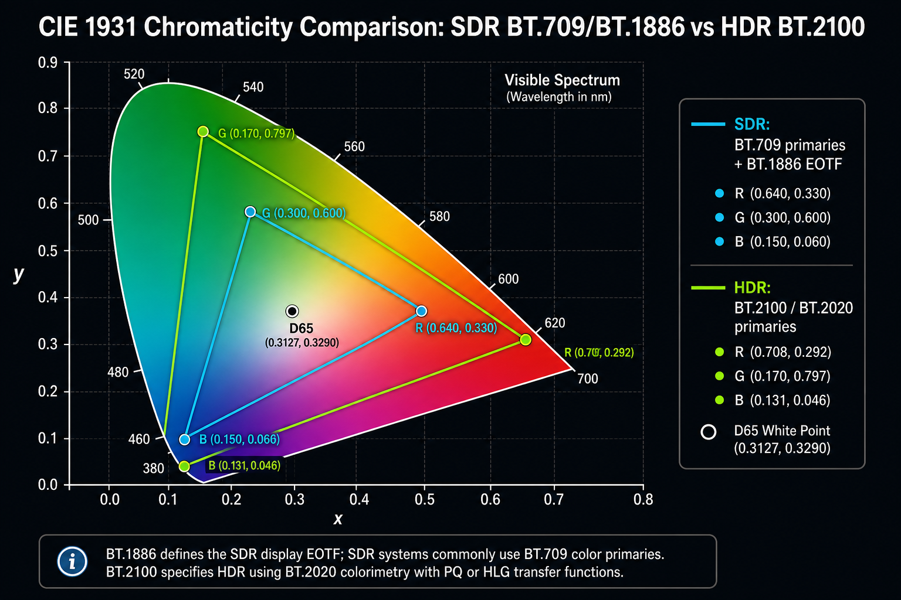
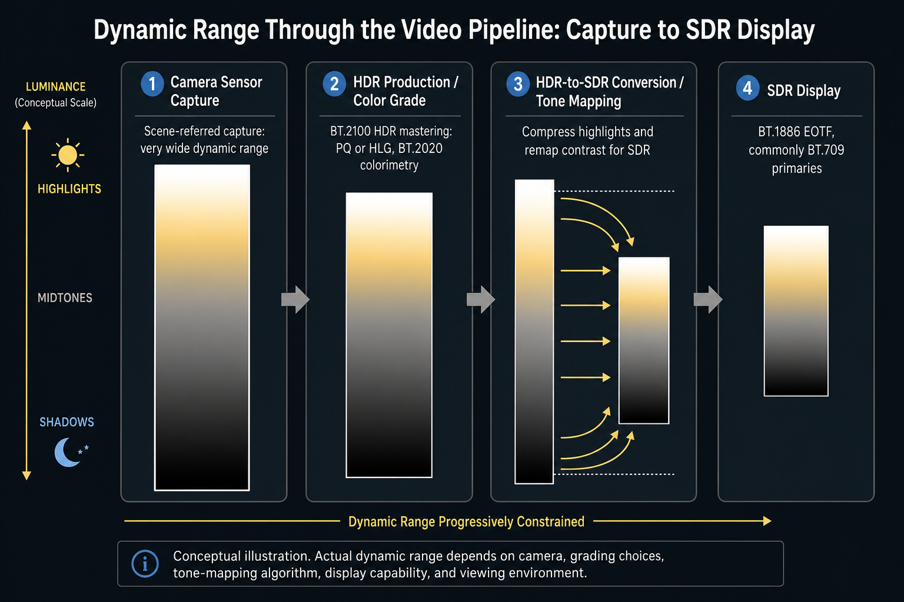

# 4Kp60 SDI-based Genlock HDR Video Pipeline System Example Design for Agilex™ 5 Devices

---

## Contents

* [Functional Description](#functional-description)
* [VVP-Based Video Pipeline IP Components](#vvp-based-video-pipeline-ip-components)
* [Genlock Video Synchronization](#genlock-video-synchronization)
* [3D LUT-Based HDR-to-SDR Conversion](#3d-lut-based-hdr-to-sdr-conversion)
* [3D LUT Cube Files](#3d-lut-cube-files)
* [Return to the Main User Guide](./doc-genlock-hdr.md#functional-description)

---

## Functional Description

This section describes the architecture of the 4Kp60 SDI-based Genlock HDR Video Pipeline System Example Design for Agilex™ 5 Devices. 
The design demonstrates three-dimensional lookup table (3D LUT)-based conversion between high dynamic range (HDR) and standard dynamic range (SDR) video. HDR-to-SDR conversion is required for interoperability between legacy and emerging formats in broadcast workflows.

The following table shows example SDI input and output images, after applying a 3D LUT on the input image.

|<center markdown="1">SDI Input Image</center>|<center markdown="1">SDI Output Image</center>|
| --- | --- |
|  |  |

The design receives video through an industry-standard serial digital interface (SDI) on an FPGA mezzanine card (FMC) daughter card. The SDI interface supports video standards up to 12G-SDI and can deliver video resolutions up to 4Kp60 to the FPGA fabric. The SDI IP converts pixel data to AXI4-Stream, which provides connectivity to other IP cores in the [Altera Video and Vision Processing (VVP) Suite](https://www.altera.com/products/ip/po-3150/video-and-vision-processing-suite).

The design comprises hardware and software components:

* The software is a bare-metal application that runs on a Nios® V soft processor. The application provides runtime control and debug menus through a JTAG UART interface.

  The following figure shows the interaction between the Nios® V software and the hardware in the FPGA fabric.

<p align="center">
  
  <br><em>Figure. SDI-based Genlock HDR Video Pipeline Example Design—Top-Level System Block Diagram</em>
</p>

* The hardware includes one bypass path and two HDR datapaths. Each path is fully genlocked and does not use a frame buffer. The hardware also includes VVP Suite IP cores and an embedded processor subsystem. Each HDR datapath contains a 3D LUT IP core that is initialized with 3D cube files that implement a specific HDR-to-SDR conversion.

  A Mixer IP at the output of the pipeline combines the HDR and bypass streams with a background layer from the Test Pattern Generator (TPG) IP into a single video frame. The software can configure the Mixer IP for side-by-side display of the input video and the 3D LUT result. Processed video leaves the design through the SDI transmit interface.

  The following figure shows the main hardware components and subsystems.

<p align="center">
  
  <br><em>Figure. SDI-based Genlock HDR Video Pipeline Example Design—Top-Level Hardware Block Diagram</em>
</p>


---

## VVP-Based Video Pipeline IP Components

This section describes the IP cores that implement the video pipeline.

### SDI RX/TX Subsystem

The SDI receive (RX) and transmit (TX) subsystem is based on the GTS SDI II IP core and supports HD-SDI, 3G-SDI, 6G-SDI, and 12G-SDI.

The GTS SDI II IP includes the following components:

* Transceiver blocks, including PHY Management and Direct PHY IP
* Protocol block
* CV2AXI receiver bridge
* AXI2CV transmitter bridge

The following figure shows the GTS SDI II IP block diagram.

<p align="center">
  
  <br><em>Figure. GTS SDI II IP Block Diagram</em>
</p>

The transceiver blocks implement serial transport. The Direct PHY IP converts high-speed serial data to and from formatted parallel data. PHY Management performs low-level configuration, tuning, and real-time monitoring, including clock and rate detection for uncompressed video.

The protocol block performs SDI-specific processing in the parallel data domain.

The CV2AXI bridge converts clocked video to AXI4-Stream (full variant). The AXI2CV bridge performs the reverse conversion. These bridges enable the SDI IP to use the Altera FPGA Streaming Video protocol. The Altera FPGA Streaming Video protocol is an AXI4-Stream-based protocol with extensions for metapackets and active video. The protocol provides connectivity to VVP Suite IP cores and other AXI4-Stream-compliant video IP.

#### Related Information

* [GTS SDI II IP User Guide](https://docs.altera.com/r/docs/823539/25.3/gts-sdi-ii-ip-user-guide/gts-sdi-ii-ip-quick-reference)

### Chroma Resampler IP

The human visual system has higher spatial acuity for brightness than for color. Color spaces such as YCbCr separate luma (brightness) from chroma (color), which allows chroma to be sampled at a lower rate while preserving most perceived detail. Chroma subsampling reduces bandwidth for transport and storage and can reduce FPGA resource utilization.

The 3D LUT IP accepts 4:4:4 chroma sampling only. This design therefore instantiates two Chroma Resampler (CRS) IP cores:

* The input CRS converts supported YCbCr formats to 4:4:4 for downstream processing.
* The output CRS restores the chroma sampling format received by the SDI RX IP.

The CRS IP supports 4:4:4, 4:2:2, and 4:2:0 sampling on both streaming interfaces. You can enable the conversion paths required for any supported input and output sampling combination.

The sampling formats are defined as follows:

* **4:4:4**—Y, Cb, and Cr have the same number of samples. Each Y sample has one Cb sample and one Cr sample.
* **4:2:2**—Cb and Cr are sampled at half the luma rate horizontally. Each pair of Y samples shares one Cb sample and one Cr sample.
* **4:2:0**—Cb and Cr are sampled at half the luma rate horizontally and vertically. Each 2×2 group of four Y samples shares one Cb sample and one Cr sample.

#### Related Information

* [Chroma Resampler IP](https://docs.altera.com/r/docs/683329/25.1/video-and-vision-processing-suite-ip-user-guide/chroma-resampler-ip)

### Color Space Converter IP

Color space conversion is required when video moves between systems that use different color representations. For example, displaying television content on a computer monitor can require Y′CbCr to R′G′B′ conversion. Sending computer graphics into an SDI path can require the reverse conversion.

A color space defines how colors are represented in a three-dimensional coordinate system. R′G′B′ is commonly used for computer displays. Y′CbCr is commonly used for digital television and video transport.

The 3D LUT IP processes RGB data only. This design instantiates two Color Space Converter (CSC) IP cores:

* The front-end CSC converts Y′CbCr to R′G′B′ before the 3D LUT.
* The back-end CSC converts R′G′B′ to Y′CbCr before output.
* If the input is already R′G′B′, the CSC operates in bypass mode.

You can update CSC conversion coefficients at run time through an Avalon® memory-mapped interface.

#### Related Information

* [Color Space Converter IP](https://docs.altera.com/r/docs/683329/25.1/video-and-vision-processing-suite-ip-user-guide/color-space-converter-ip)

### Protocol Converter IP

The Protocol Converter IP converts video streams among the following protocols:

* Avalon® Streaming Video (legacy)
* Altera Streaming Video lite variant
* Altera Streaming Video full variant

You can select any of these protocols for the input and output interfaces. This capability enables systems that mix IP cores from both Altera video libraries:

* VVP cores use the AXI4-Stream-based Altera Streaming Video protocol.
* Video and Image Processing cores use Avalon Streaming Video.

In this design, the Protocol Converter IP is used as follows:

* The input Protocol Converter converts the Altera Streaming Video full variant (active video and metadata from SDI RX) to the lite variant (active video only), because the 3D LUT IP accepts the lite variant only.
* The output Protocol Converter converts the lite variant to the full variant for the SDI TX IP.

#### Related Information

* [Protocol Converter IP](https://docs.altera.com/r/docs/683329/25.1/video-and-vision-processing-suite-ip-user-guide/protocol-converter-ip)
* [Altera® FPGA Streaming Video Protocol Specification](https://docs.altera.com/r/docs/683397/current/altera-streaming-video-protocol-specification/about-the-altera-streaming-video-protocol)

### AXI-Stream Broadcaster IP

The AXI-Stream Broadcaster IP replicates one input video stream to multiple outputs. The IP includes AXI4-Stream broadcast logic and synchronous streaming FIFO buffers. The number of outputs (*N*) is a compile-time parameter.

In this design, the IP has one input from the SDI RX datapath and three outputs: one passthrough (bypass) path and two HDR datapaths.

#### Related Information

* [AXI-Stream Broadcaster IP](https://docs.altera.com/r/docs/683329/25.1/video-and-vision-processing-suite-ip-user-guide/axi-stream-broadcaster-ip)

### 3D LUT IP

The 3D LUT IP maps input color values to output color values using interpolated lookup-table data. You can initialize LUT values in the design or program LUT values at run time.

Configurable options include LUT size, bits per color, pixels in parallel, double buffering, an output alpha channel, and initialization from a built-in file. Internally, the IP uses tetrahedral interpolation between LUT subcube vertices.

Typical applications include the following:

* Color space conversion
* Chroma keying
* Dynamic range conversion
* Artistic effects, including sepia, hue rotation, and color volume adjustment

In this design, two HDR datapaths demonstrate dynamic range conversion. Each datapath uses one 3D LUT IP core with double buffering enabled. Each IP instance can store two built-in LUT cube files of size 33³.

#### Related Information

* [3D LUT IP](https://docs.altera.com/r/docs/683329/25.1/video-and-vision-processing-suite-ip-user-guide/about-the-3d-lut-ip)

### Clipper IP

The Clipper IP extracts an active region from a video stream and discards the remaining pixels. You can define the region with edge offsets, or with a top-left corner plus width and height.

The Clipper IP can update output resolution using VVP image-information metadata packets, or through the register interface when configured for lite variants. An Avalon® memory-mapped interface supports runtime clipping updates.

In this design, the Clipper IP operates with the Mixer IP to generate a side-by-side view from any two of the three video datapaths.

#### Related Information

* [Clipper IP](https://docs.altera.com/r/docs/683329/25.1/video-and-vision-processing-suite-ip-user-guide/clipper-ip)

### Test Pattern Generator IP

The Test Pattern Generator (TPG) IP produces an Altera Streaming Video-compliant output stream. Each field contains one of the supported fixed test images. You can adjust resolution, color space, chroma subsampling, and pattern selection at run time.

In this design, the TPG IP supplies the Mixer base (background) layer. The default pattern is solid blue.

#### Related Information

* [Test Pattern Generator IP](https://docs.altera.com/r/docs/683329/25.1/video-and-vision-processing-suite-ip-user-guide/test-pattern-generator-ip)

### Mixer IP

The Mixer IP overlays video fields from multiple input streams, with or without alpha blending. The IP supports up to eight layers. Layer 0 is the base (background) layer. Higher-numbered layers overlay the base layer. The base-layer resolution defines the output resolution. Horizontal and vertical offsets place each overlay so that the first pixel of the overlay appears at the required position. The overlay must remain entirely within the base layer.

In this design, the Mixer IP and Clipper IP generate a side-by-side view from any two of the HDR channels and the bypass channel. The following table lists the Mixer layer sources.

| Layer | Source |
|:-----:|--------|
| 3 | HDR channel 2 |
| 2 | HDR channel 1 |
| 1 | Bypass channel |
| 0 | TPG (base / background) |

#### Related Information

* [Mixer IP](https://docs.altera.com/r/docs/683329/25.1/video-and-vision-processing-suite-ip-user-guide/mixer-ip)

---

## Genlock Video Synchronization

Video synchronization and low latency are important requirements in an FPGA video pipeline. Correct synchronization of the video input and output interfaces helps prevent data corruption. Depending on the implementation, genlock can also reduce memory utilization and latency by reducing or eliminating frame buffers.

The video pipeline in this example design uses the following three asynchronous clocks:

* The input reference pixel clock (148.5 MHz), provided by an external clock generator on the development kit
* The video processing clock (300 MHz), generated by an on-chip clock generator on the Agilex™ device
* The output reference pixel clock (297 MHz), generated by a programmable clock generator on the Nextera VIDIO 12G-SDI FMC daughter card

If the input and output pixel clocks are asynchronous, frequency drift accumulates over time. To prevent drift, generate an output pixel clock that is phase-locked and frequency-locked to a reference input pixel clock.

On the Nextera 12G-SDI FMC card, the LMH1983 and LMK03328 clock generators, together with LMH1981 bi-level and tri-level genlock, generate an output pixel clock that is phase-locked and frequency-locked to the reference input pixel clock.

The following figure shows the functional block diagram of the VIDIO 12G-SDI FMC daughter card.

<p align="center">
  
  <br><em>Figure. VIDIO 12G-SDI FMC Daughter Card—Functional Block Diagram</em>
</p>

The LMH1981 device provides three sync signals: odd/even field, HSYNC, and VSYNC (FHV). The FHV signals are derived from the SDI RX IP core and are routed to the LMH1981 device through FPGA I/O.

The LMH1981 sync separator and the LMH1983 clock generator lock SDI TX to an incoming analog reference signal. In this design, the analog reference is tri-level FHV sync. The LMH1981 device extracts raw timing pulses from the analog reference. The LMH1983 and LMK03328 devices use those pulses to generate a genlocked transmit pixel clock.

Because of this genlock implementation, the example design does not use frame buffers. The result is a bufferless video pipeline with subframe latency.

#### Related Information

* [White Paper: Designing Genlocked Video Systems with Deterministic Low Latency on FPGAs](https://docs.altera.com/v/u/docs/828717/designing-genlocked-video-systems-with-deterministic-low-latency-on-fpgas-white-paper)
* [Genlock Signal Router IP](https://docs.altera.com/r/docs/683329/25.1/video-and-vision-processing-suite-ip-user-guide/about-the-genlock-signal-router-ip)
* [Genlock Controller IP](https://docs.altera.com/r/docs/683329/25.1/video-and-vision-processing-suite-ip-user-guide/genlock-controller-ip)

---

## 3D LUT-Based HDR-to-SDR Conversion

This example design uses the 3D LUT IP to convert HDR video formats to SDR. This section describes HDR characteristics and the use of FPGA devices in HDR conversion workflows.

HDR video is not defined only by increased brightness. HDR systems specified by ITU-R BT.2100 support higher peak luminance than SDR systems specified by ITU-R BT.709 and BT.1886. HDR systems can support peak luminance of 1,000 nits or greater. Values in the range of 1,000 nits to 4,000 nits are commonly cited, depending on the system. Typical SDR mastering and display practice uses approximately 100 nits to 300 nits.

The following figure compares dynamic range among HDR, SDR, and human vision.

<p align="center">
  
  <br><em>Figure. Dynamic Range Comparison Among HDR, SDR, and Human Vision</em>
</p>

HDR video combines expanded dynamic range, a wider color gamut, and greater bit depth. These characteristics together define HDR as used in the broadcast industry.

The following figure compares the ITU-R BT.2100 and ITU-R BT.709 color gamuts.

<p align="center">
  
  <br><em>Figure. Color Gamut Comparison: ITU-R BT.2100 and ITU-R BT.709</em>
</p>

Current HDR video ecosystems use multiple transfer functions. PQ and HLG are standardized in ITU-R BT.2100. Other transfer functions are proprietary or vendor-specific, including S-Log3 and LogC4.

Video workflows therefore often require HDR-to-HDR transcoding, for example PQ to HLG or S-Log3 to PQ, and HDR-to-SDR conversion for legacy delivery. Broadcast standards typically change slowly. After an SDR format such as BT.709 / BT.1886 is widely adopted, the format can remain in use for decades. As HDR deployment increases, HDR-to-SDR and SDR-to-HDR conversion remains a practical requirement.

The following figure shows the reduction in dynamic range through the capture-to-display pipeline when HDR content is mapped to SDR.

<p align="center">
  
  <br><em>Figure. Reduction in Dynamic Range Through the Capture-to-Display Pipeline When Mapping HDR to SDR</em>
</p>

[Report ITU-R BT.2446](https://www.itu.int/pub/r-rep-bt.2446) describes methods for converting between HDR and SDR content and leaves many implementation choices to equipment manufacturers. That flexibility allows vendors to add refinements and proprietary processing. FPGA devices provide the performance and reconfigurability required for HDR video pipelines.

> **Note:** The Altera VVP IP library provides the building blocks for an FPGA-based HDR video platform. You can implement HDR-to-SDR conversion and HDR-to-HDR conversion by reprogramming 3D LUT contents to match the required color and dynamic-range transform.

## 3D LUT Cube Files

The example design includes `.cube` files that demonstrate 3D LUT IP operation. Altera generated these files for demonstration only. The files are not intended for production or final product deployment. The implementation is based on the following specifications:

* [HLG (ITU-R BT.2100)](https://www.itu.int/dms_pubrec/itu-r/rec/bt/R-REC-BT.2100-3-202502-I!!PDF-E.pdf)
* [PQ (ITU-R BT.2100)](https://www.itu.int/dms_pubrec/itu-r/rec/bt/R-REC-BT.2100-3-202502-I!!PDF-E.pdf)
* [S-Log3](https://pro.sony/en_GB/technology/s-log)
* [BT.1886](https://www.itu.int/dms_pubrec/itu-r/rec/bt/r-rec-bt.1886-0-201103-i!!pdf-e.pdf)
* [BT.709](https://www.itu.int/dms_pubrec/itu-r/rec/bt/R-REC-BT.709-6-201506-I!!PDF-E.pdf)

The `.cube` files are located in `src/vds/test_luts/`:

```text
<Example Design>/
├── sdi_genlock_hdr_ed.qpf   # Quartus project file
├── sdi_genlock_hdr_ed.qsf   # Quartus settings file
├── da_drc.dawf              # Design Assistant waiver file
├── README.md                # Repository readme
├── docs/                    # User guide for this example design
├── output_files/            # Precompiled SOF
├── script/                  # Scripts used to generate the example design
└── src/
    ├── ip/                  # .ip files
    ├── rtl/                 # RTL and SDC files
    ├── sw/                  # Bare-metal software application
    └── vds/                 # Tcl to generate the Visual Designer Studio (VDS) project
        └── test_luts/       # A collection of 3D cube files to preconfigure the 3D LUT IP
```

Currently, there are five `.cube` files availables:

| Cube file | Description |
|:---:|--------|
| `pq_to_bt709.cube` | Enable HDR-to-SDR conversion: PQ (BT.2100) to BT.709 |
| `hlg_to_bt709.cube` | Enable HDR-to-SDR conversion: HLG (BT.2100) to BT.709 |
| `slog3_to_bt709.cube` | Enable HDR-to-SDR conversion: S-Log3 to BT.709 |
| `slog3_to_bt709_opt2.cube` | Enable HDR-to-SDR conversion: S-Log3 (S-Gamut3.Cine) to BT.709 |
| `id_nrm_33.cube` | Unity transformation |

To add new `.cube` files to this project, please modify the following two scripts accordingly, 
by adding the name of the new set of cubes.

* `<Example Design>/script/generation_step_vds.tcl`
* `<Example Design>/src/vds/nios_sdi_ss.tcl`

Additionally, Precomputed LUT libraries are also available elsewhere for HDR-to-SDR conversion and for creative look profiles. 
For more information, refer to the following resources:

* [Sony Professional Video LUT Library](https://pro.sony/en_GB/technology/professional-video-lut-look-up-table)
* [BBC R&D HDR TV HLG LUT Release Notes](https://downloads.bbc.co.uk/rd/pubs/papers/HDR/BBC_HDRTV_HLG_LUT_Release_Notes_v1-7.pdf)

---

[Return to the Main User Guide](./doc-genlock-hdr.md#functional-description)


